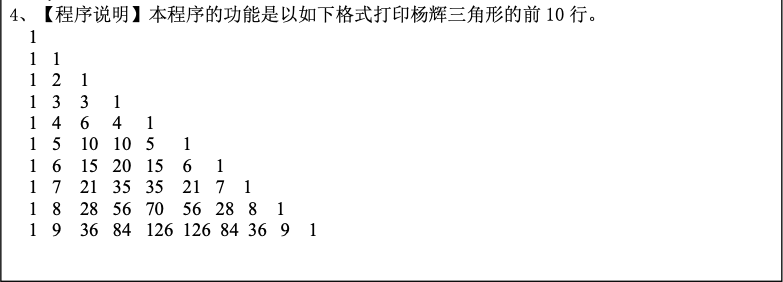
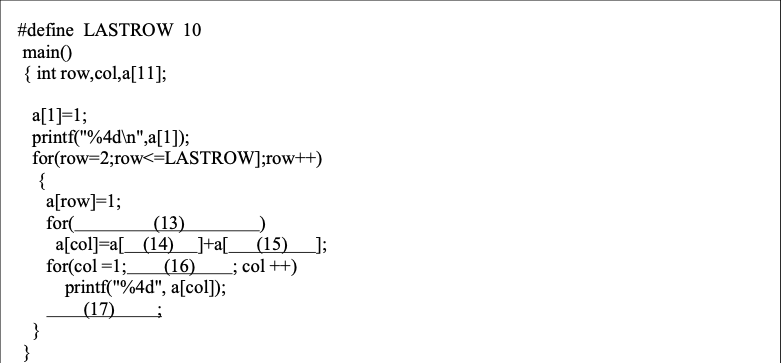
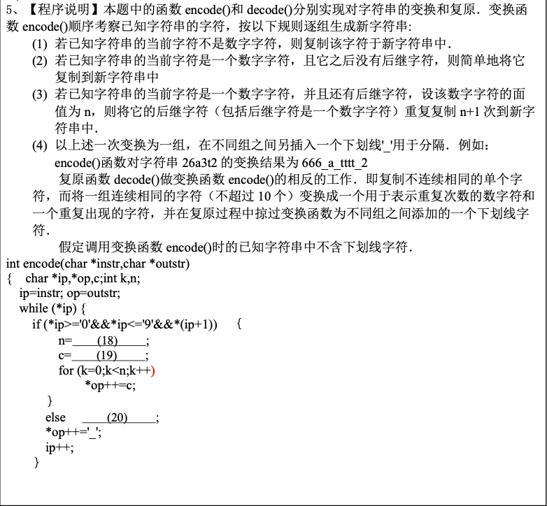
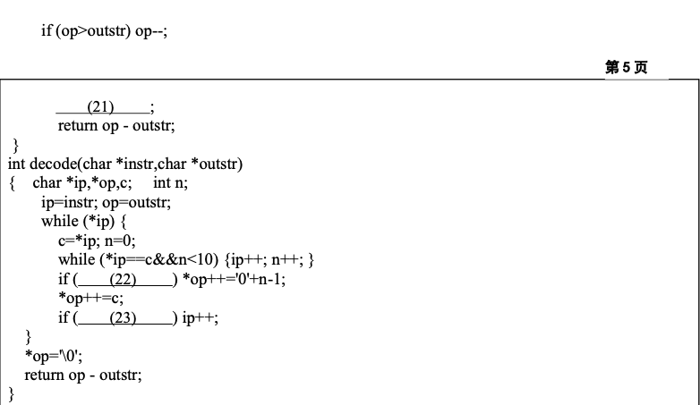

# 2004年
## 三
4. 



```c
#include <stdio.h>
#define LASTROW 10

int main() {
    int row, col, a[11];
    a[1] = 1;
    printf("%4d\n", a[1]);
    for (row = 2; row <= LASTROW; row++) {
        a[row] = 1;
        for (col = row-1;col > 1;col --)
            a[col] = a[col] + a[col-1];
        for (col = 1;col <= row; col++)
            printf("%4d", a[col]);
        printf("\n");
    }
}
```
5. 




```c
#include <stdio.h>
#include <stdlib.h>

int encode(char *instr, char *outstr) {
    char *ip, *op, c;
    int k, n;
    ip = instr;
    op = outstr;
    while (*ip) {
        //（3）是数字并且后后继字符
        if (*ip >= '0' && *ip <= '9' && *(ip + 1)) {
            //(3)*ip字面值为n，重复n+1次
            n = *ip + 1 - '0';
            //（3）*ip的下一个字符
            c = *++ip;
            for (k = 0; k < n; k++)
                *op++ = c;
        } else
            //(2)是数字并且没有后继字符，将其复制到新字符串
            (*op++ = *ip);
        *op++ = '_';
        ip++;
    }
    if (op > outstr)
        op--;
    //结束字符串，加不加都行
    *op = '\0';
    //返回处理后的字符个数。一开始op和outstr指向的地址相同。随着对字符的处理，op一直在自增。
    return op - outstr;
}

int decode(char *instr, char *outstr) {
    char *ip, *op, c;
    int n;
    ip = instr;
    op = outstr;
    while (*ip) {
        c = *ip;
        n = 0;
        while (*ip == c && n < 10) {
            ip++;
            n++;
        }
        //当字符连续时，将这一个字符表示的值-1，放到新数组中
        if (n > 1)
            *op++ = '0' + n - 1;
        //不连续时，简单复制
        *op++ = c;
        //忽略下划线
        if (*ip == '_')
            ip++;
    }
    *op = '\0';
    return op - outstr;
}

int main() {
    char *str1 = "26a3t2";
    char *str2 = (char *) malloc(sizeof(char));
    char *str3 = (char *) malloc(sizeof(char));

    printf("str1 = %s\n", str1);
    int e = encode(str1, str2);
    printf("%d\n", e);
    printf("str2 = %s\n", str2);
    int d = decode(str2, str3);
    printf("%d\n", d);
    printf("str3 = %s\n", str3);
    return 0;
}
```