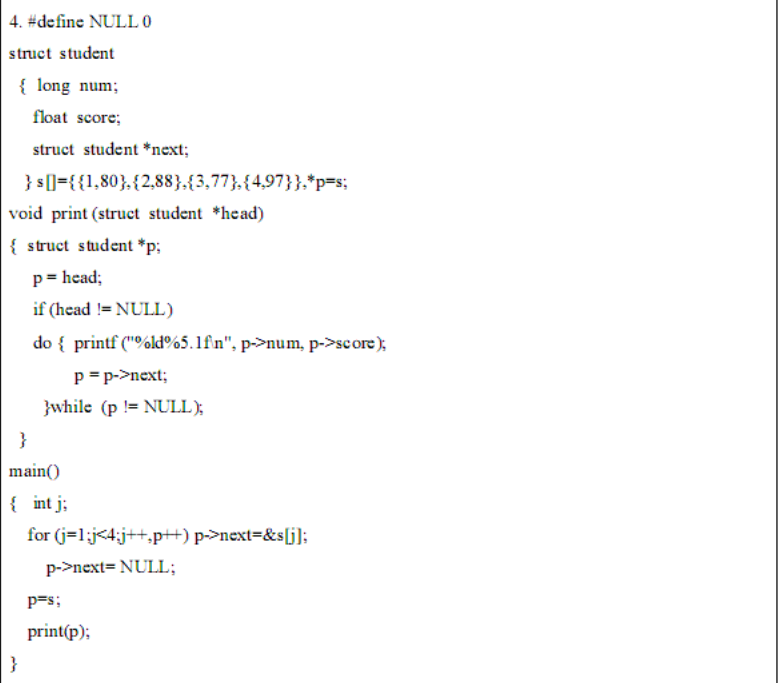
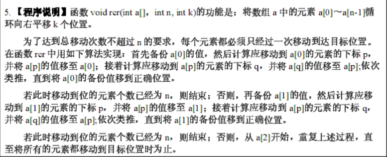
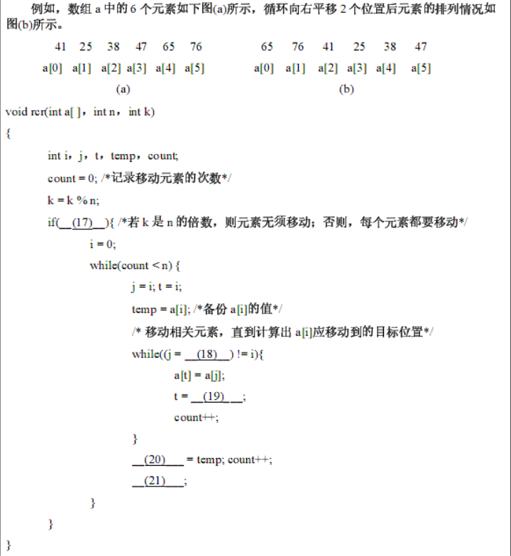

# 2005年真题
## 二
4. 


```c
#include <stdio.h>

#define NULL 0
struct student {
    long num;
    float score;
    struct student *next;
} s[] = {{1, 80},
         {2, 88},
         {3, 77},
         {4, 97}}, *p = s;

void print(struct student *head) {
    struct student *p;
    //从头开始打印出结构体数组中内容
    p = head;
    if (head != NULL)
        do {
            printf("%ld%5.1f\n", p->num, p->score);
            p = p->next;
        } while (p != NULL);
}

int main() {
    int j;
    //将p->next指向s[1],s[2],s[3]
    for (j = 1; j < 4; j++, p++)
        p->next = &s[j];
    p->next = NULL;
    //将结构体数组s传给p
    p = s;
    print(p);
}
```

5. 

