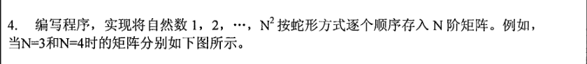
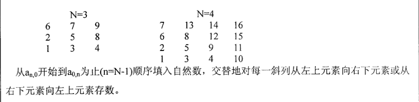

# 2009年

## 四

4. 



```c
#include <stdio.h>

#define SIZE 100

int main() {
    int i, j, m = 0, n, N, count = 2;
    int a[SIZE][SIZE] = {0};
    printf("输入N：");
    scanf("%d", &N);
    n = N - 1;
    a[n][m] = 1;
    a[--n][m] = count++;  //上一格
    while (count <= N * N) {
        while (n < N - 1 && m < N - 1)   //行和列不在边界
            a[++n][++m] = count++;      //右下一格
        if (n == N - 1 && m != N - 1)     //最后一行并且非最后一列
            a[n][++m] = count++; //往右一格
        else                        //不管是不是最后一行，最后一列
            a[--n][m] = count++; //上一格
        while (m > 0 && n > 0)     //行或列不在边界上，左上一格
            a[--n][--m] = count++;
        if (n != 0 && m == 0)        //第一列并且非第一行
            a[--n][m] = count++;  //上一格
        else                        //不管是不是第一列，但是第一行
            a[n][++m] = count++; //右一格
    }
    for (i = 0; i < N; i++) {
        for (j = 0; j < N; j++)
            printf("%d\t", a[i][j]);
        printf("\n");
    }
    return 0;
}
```