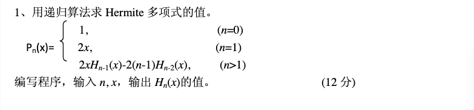

# 2014
## 五

1. 

```c
#include <stdio.h>
double Her(double x,int n){
    if(n == 0) return 1;
    else if (n == 1) return 2*x;
    else
        return 2*x*Her(x,n-1)-2*(n-1)*Her(x,n-2);
}
int main() {
    double x;
    int n;
    printf("Input x,n(n≥0):");
    scanf("%lf,%d",&x,&n);
    if(n<0)
        printf("Please input n≥0!");
    else
        printf("%g",Her(x,n));
    return 0;
}
```


2. 

- 方法一：
```c
#include <stdio.h>
#include <math.h>
int main(){
    double e = 2,y;
    long n = 1;
    while (e-y>1e-6){
        y = e;
        ++n;
        e=pow(1+1/(double)n,(double)n);
    }
    printf("e = %f\nn = %ld\n",e,n);
    }
```

- 方法二：
```c
#include <stdio.h>
#include <math.h>
int main() {
   double a = 2,y;
   long int n=1;
   do{
       y=a;
       n+=1;
       a=pow(1+1/(double)n,(double)n);
   }while(a-y>1e-6);
   printf("e = %f\nn = %ld\n",a,n);
   return 0;
}
```

3. **输入 n 个学生的学号、姓名、数学成绩、语文成绩和英语成绩，求出每位学生的三门课程的总分，然后按总分由高到低排序，并将排序结果按学号、姓名、数学成绩、语文成绩、英语成绩、总分和名次打印输出到屏幕和文件 student.dat 中。要求用结构体描述学生信息，输出打印时每位学生信息占一行且上下列对齐，总分相同时名次相同，例如，假设有四个成绩为 280、275、275、250，则对应的名次为 1、2、2、4。 (18 分)**

分析：
 1.
- 记录学生成绩等信息，考察结构体数组；
- 由高到低排序，考察冒泡排序、选择排序
- 考察文件读写
 2.
- 涉及到排序，不能用链表，要用数组

```c
#include <stdio.h>
#include <stdlib.h>

typedef struct STU {
    char sid[20];
    char name[20];
    float score[3];
    float total;
} Student;//此处Student是自己定义的类型，原型：typedef type name;

void sort(Student stu[], int num);

int main() {
    int num;
    int rank, count = 1, real = 1;
    Student *p;
    FILE *fp;
    p = (Student *) malloc(sizeof(Student));
    printf("学生人数：");
    scanf("%d", &num);
    printf("输入学号 姓名 数学 语文 英语成绩，空格间隔\n");
    for (int i = 0; i < num; i++) {
        //此处需要用到地址，数组名不需要加&，变量需要加&
        scanf("%s%s%f%f%f", (p + i)->sid, (p + i)->name, &(p + i)->score[0], &(p + i)->score[1], &(p + i)->score[2]);
        (p + i)->total = (p + i)->score[0] + (p + i)->score[1] + (p + i)->score[2];
    }
    sort(p, num);
    if ((fp = fopen("student.dat", "w")) == NULL) {
        printf("open file error");
        exit(0);
    }
    for (int i = 0; i < num; i++) {
        //此学生排名与前一个学生排名是否相同？若相同
        if (((p + i)->total) == ((p + i - 1)->total)) {//当前这位同学和前一名同学分数相同
            rank = real;                //真实名次，并且名次不变，下次循环若成绩相同，仍然使用此名次，若名次不同，则使用else中的real并且更新real
            count++;                    //计数器+1
        } else {                         //两名同学成绩不同的话
            real = count++;             //真实名次为计数器的数字，此处更新real的值，以便下次循环使用
            rank = real;                //成绩不同时，显示当前计数器的名次
        }
        //%-10:左对齐，每个数占10个宽度，在10个宽度中靠左
        //%8：右对齐，每个数占8个宽度，在这8个宽度中靠右
        printf("%-8s%-10s%-8g%-8g%-8g%-8g", (p + i)->sid, (p + i)->name, (p + i)->score[0], (p + i)->score[1],
               (p + i)->score[2], (p + i)->total);
        fprintf(fp, "%-8s%-10s%-8g%-8g%-8g%-8g", (p + i)->sid, (p + i)->name, (p + i)->score[0], (p + i)->score[1],
                (p + i)->score[2], (p + i)->total);
        printf("第%d名\n", rank);
        fprintf(fp, "第%d名\n", rank);
    }
    fclose(fp);
    return 0;
}

//冒泡排序
void sort(Student stu[], int num) {
    Student tmp;
    for (int i = 0; i < num; i++)
        for (int j = 0; j <= num; j++)
            if (stu[j].total < stu[j + 1].total) {
                tmp = stu[j];
                stu[j] = stu[j + 1];
                stu[j + 1] = tmp;
            }
}

```