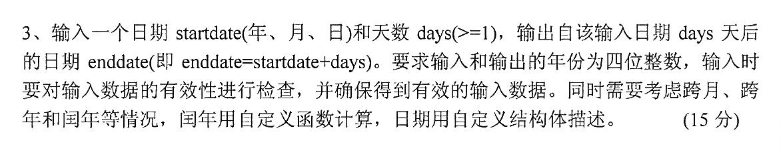

# 2015
## 五

1.
```c
#include <stdio.h>

int F(n) {
    if (n == 1 || n == 2)
        return 1;
    else
        return F(n - 1) + F(n - 2);
}

int main() {
    int sum = 0;
    FILE *fp;
    fp = fopen("fab.txt", "w");
    for (int i = 1; i <= 20; i++) {
        fprintf(fp, "%d\n", F(i));
        sum += F(i);
    }
    printf("%d", sum);
    fclose(fp);
    return 0;
}
```

3. 

此代码有待改善
```c
#include <stdio.h>
struct Date{
    int year;
    int month;
    int day;
}startdate,enddate;
int Ryear(int year){
    if((year%4==0 && year %100!=0) || year %400==0)
        return 29;
    else
        return 28;
}
int main() {
    int days;
    printf("输入开始日期：yyyy/mm/dd:");
    scanf("%d/%d/%d",&startdate.year,&startdate.month,&startdate.day);
    printf("输入天数:");
    scanf("%d",&days);
    switch(startdate.month){
        case 1:case 3:case 5:
        case 7:case 8:case 10:
        case 12:enddate.day = 31;
            break;
        case 4:case 6:case 9:
        case 11:enddate.day = 30;
            break;
        case 2:enddate.day = Ryear(startdate.year);
            break;
    }
    while (1) {
        if (startdate.year >= 1000&&startdate.year <= 9999)
            break;
            printf("输入年份格式错误重新输入\n");
            printf("输入年份：(yyyy)");
            scanf("%d", &startdate.year);
    }
    while (1) {
        if(startdate.month > 0&&startdate.month<=12)
            break;
            printf("输入月份格式错误");
            printf("输入月份：(mm)");
            scanf("%d", &startdate.month);
            switch(startdate.month){
                case 1:case 3:case 5:
                case 7:case 8:case 10:
                case 12:enddate.day = 31;
                    break;
                case 4:case 6:case 9:
                case 11:enddate.day = 30;
                    break;
                case 2:enddate.day = Ryear(startdate.year);
                    break;
        }
    }
    while (1) {
        if(startdate.day>0&&startdate.day <= enddate.day)
            break;
            printf("输入日期格式错误");
            printf("输入日期：(dd)");
            scanf("%d", &startdate.day);
    }
    while (1) {
        if(days>=0)
            break;
            printf("输入天数格式错误");
            printf("天数：");
            scanf("%d", &days);
    }
    startdate.day += days;
    enddate.month = startdate.month;
    while (startdate.day > enddate.day){
        startdate.day -= enddate.day;
        enddate.month += 1;
        if(enddate.month > 12){
            enddate.month = 1;
            enddate.year = startdate.year + 1;
        }
//            enddate.day = Ryear(enddate.year);
            switch(enddate.month){
                case 1:case 3:case 5:
                case 7:case 8:case 10:
                case 12:enddate.day = 31;
                    break;
                case 4:case 6:case 9:
                case 11:enddate.day = 30;
                    break;
                case 2:enddate.day = Ryear(enddate.year);
                    break;
            }
    }
    enddate.day = startdate.day;
    if(enddate.year>9999)
        printf("超出年限！");
    else
        printf("新的日期为：%d/%d/%d",enddate.year,enddate.month,enddate.day);
    return 0;
}
```