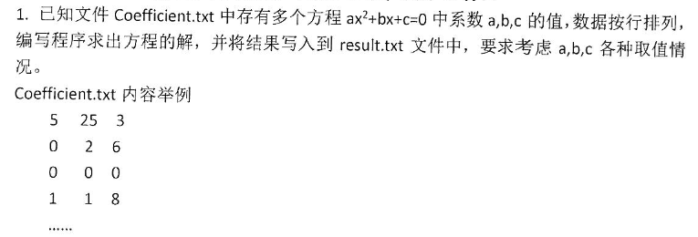
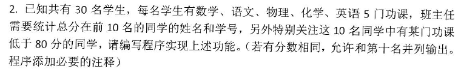
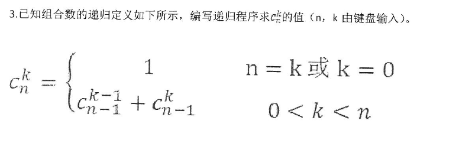

# 2016

## 五

1. 


Coefficient.txt
```
5   25  3
0   2   6
0   0   0
1   1   8
4   6   9
0   0   8
1   -5  6
1   2   1
1   2   2
2   6   1
```
result.txt
```
方程5x^2+25x+3=0: 两个不同的实根：  -0.123 和  -4.877
方程0x^2+2x+6=0: x = -3
方程0x^2+0x+0=0: 无穷个解
方程1x^2+1x+8=0: 两个共轭复根：    -0.5+2.78388i 和    -0.5-2.78388i
方程4x^2+6x+9=0: 两个共轭复根：   -0.75+1.29904i 和   -0.75-1.29904i
方程0x^2+0x+8=0: 无解
方程1x^2+-5x+6=0: 两个不同的实根：       3 和       2
方程1x^2+2x+1=0: 两个相同解x1=x2=-1
方程1x^2+2x+2=0: 两个共轭复根：      -1+1i 和      -1-1i
方程2x^2+6x+1=0: 两个不同的实根： -0.1771 和  -2.823

```


```c
#include <stdio.h>
#include <stdlib.h>
#include <math.h>

void jie(double a, double b, double c, FILE *in) {
    double disc, x1, x2, realpart, imagpart;

    if (fabs(a) <= 1e-6)     //a为0时，一元方程
        if (b == 0)          //b也为0时
            if (c == 0)
                fprintf(in, "无穷个解\n");   //a，b，c为0时，无穷多解
            else
                fprintf(in, "无解\n");   //a，b为0，c不为0，无解
        else
            fprintf(in, "x = %g\n", -c / b);    //一次方程的解
    else {                    //a不为0时
        disc = b * b - 4 * a * c;
        if (fabs(disc) <= 1e-6)
            fprintf(in, "两个相同解x1=x2=%g\n", -b / (2 * a));
        else if (disc > 1e-6) {
            x1 = (-b + sqrt(disc)) / (2 * a);
            x2 = (-b - sqrt(disc)) / (2 * a);
            fprintf(in, "两个不同的实根：%8.4g 和%8.4g\n", x1, x2);
        } else {
            realpart = -b / (2 * a);
            imagpart = sqrt(-disc) / (2 * a);
            fprintf(in, "两个共轭复根：");
            fprintf(in, "%8.4g+%gi", realpart, imagpart);
            fprintf(in, " 和");
            fprintf(in, "%8.4g-%gi\n", realpart, imagpart);
        }
    }
}

int main() {
    double a, b, c;
    FILE *out, *in;
    if ((out = fopen("Coefficient.txt", "r")) == NULL) {
        printf("can't open file!\n");
        exit(0);
    }
    if ((in = fopen("result.txt", "w")) == NULL) {
        printf("can't open file!\n");
        exit(0);
    }

    while (!feof(out)) {
        fscanf(out, "%lf%lf%lf", &a, &b, &c);
        fprintf(in, "方程%gx^2+%gx+%g=0: ", a, b, c);
        jie(a, b, c, in);
    }
    fclose(out);
    fclose(in);
    return 0;
}
```

2. 


```c
/*
 * 已知共有30名学生，每名学生有数学，语文，物理，化学，英语5门功课，
 * 班主任需要统计总分在前10名的同学的姓名和学号，另外特别关注这10名同学中有某门功课低于80分的同学，
 * 请编写程序实现上述功能。（若有分数相同，允许和第10名并列输出。程序添加必要的注释）
 *
 * 分析：
 * 1. 结构体成员包括：name,sid,score[5],
 */

#include <stdio.h>

#define num 30

typedef struct {
    char sid[20];
    char name[20];
    float score[5];
    float total;
} student;

//冒泡排序
void sort(student stu[]) {
    for (int i = 0; i < num; i++)
        for (int j = 0; j < num; j++)
            if (stu[j].total < stu[j + 1].total) {
                float tmp = stu[j].total;
                stu[j].total = stu[j + 1].total;
                stu[j + 1].total = tmp;
            }
}

//判断各科成绩是否低于80
void isLower(student stu[], int i) {
    if (stu[i].score[0] < 80)
        printf("数学低于80;");
    if (stu[i].score[1] < 80)
        printf("语文低于80;");
    if (stu[i].score[2] < 80)
        printf("物理低于80;");
    if (stu[i].score[3] < 80)
        printf("化学低于80;");
    if (stu[i].score[4] < 80)
        printf("英语低于80;");
}

int main() {
    student stu[num];
    int sameTotal = 9;
    printf("输入：学号 姓名 数学 语文 物理 化学 英语，空格间隔\n ");
    for (int i = 0; i < num; i++) {
        scanf("%s%s%f%f%f%f%f", stu[i].sid, stu[i].name, &stu[i].score[0], &stu[i].score[1], &stu[i].score[2],
              &stu[i].score[3], &stu[i].score[4]);
        stu[i].total = stu[i].score[0] + stu[i].score[1] + stu[i].score[2] + stu[i].score[3] + stu[i].score[4];
    }
    sort(stu);
    for (int i = 10; i <= 30; i++) {
        if (stu[i].total == stu[9].total)    //当第10名以后的同学总分和第10名总分相等
            sameTotal = i;                    //输出包括并列的人数
    }
    for (int i = 0; i <= sameTotal; i++) {
        printf("%-8s%-8s", stu[i].name, stu[i].sid);
        isLower(stu, i);
        printf("\n");
    }
    return 0;
}

```

3. 

```c
#include <stdio.h>
#include <stdlib.h>
int ckn(int n,int k){
    if(n == k||k == 0)
        return 1;
    else if(k>0&&k<n)
        return ckn(n-1,k-1)+ckn(n-1,k);
    else {
        printf("error!");
        exit(0);
    }
}
int main() {
    int n,k;
    printf("Input n,k:");
    scanf("%d,%d",&n,&k);
    printf("%d",ckn(n,k));
    return 0;
}
```