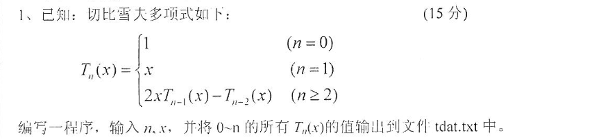

# 2017
## 一
|1|2|3|4|5|6|7|8|9|10
|-|-|-|-|-|-|-|-|-|-|
|C|C|A|C|B|A|D|B|B|C|

## 二

```
1. 6    5
2. 字母或下划线
3. float
4. 43
5. 1
6. a*(b*(c*(d+x*x)+y)+z)
7. 3
8. 1    0
```

## 三

```
1. i=30
2. 1#2#3#4#
3. 3456789012
4. !yppah
5. 60,2,30,2,15,3,5,5,

```
## 四

```
1. 
(1) i<N 
(2) i<N 
(3) <N-i 
(4) a[j]>a[j+1] 
(5) a[j]=a[j+1]
2. 
(6) &n
(7) m%10 
(8) m/10 
(9) m>0 
(10) r(m)
3. 
(11) a[i]+b[i] 
(12) a[i+1] 
(13) c++ 
(14) *cp 
(15) c-1
```

## 五
1. 


```c
/*切比雪夫多项式*/
#include <stdio.h>
#include <stdlib.h>

int T(int n, int x) {
    int k;
    if (n == 0)
        k = 1;
    else if (n == 1)
        k = x;
    else
        k = 2 * x * T(x, n - 1) - T(x, n - 2);
    return k;
}

int main() {
    int n, x;
    FILE *fp;
    if ((fp = fopen("tdat.txt", "w")) == NULL) {
        printf("error");
        exit(0);
    }
    printf("Input n,x(n>=0):");
    scanf("%d,%d", &n, &x);
    for (int i = 0; i <= n; i++)
        fprintf(fp, "%d\n", T(i, x));
    return 0;
}
```

2. **编写一个根据用户键入的两个操作数和一个双目算术运算符，由计算机输出运算结果的程序。（15分）**

#### 分析
双目算数运算符：
> <pre>+  -   *   /   %</pre>
```c
//输入两个操作数和一个双目运算符
#include <stdio.h>
int main() {
    int a,b,k;
    char c;
    printf("输入式子：");
    scanf("%d%c%d",&a,&c,&b);
    printf("%d%c%d=",a,c,b);
    switch (c){
        case '+': k=a+b;break;
        case '-': k=a-b;break;
        case '*': k=a*b;break;
        case '/': k=a/b;break;
        case '%': k=a%b;break;
        default:printf("error!");
            return 0;
    }
    printf("%d",k);
    return 0;
}
```

3. **求一个n阶方阵中满足条件“它在行上是最小的，在列上也是最小的”的所有元素，并输出元素值及所在的位置；如果没有满足上述条件的元素，请输出“NO FIND！”。例如，一个n=5的方阵如下：**

<pre style="text-align: center">
   11   4   2   7   8 
   5    9   23  1   25 
   3    22  21  18  15 
   17   16  24  12  6 
   13   10  19  20  14
</pre>


**输出结果是：2(1,3),1(2,4),3(3,1),6(4,5)。其中，2(1,3)表示2是满足条件的元素，其所在位置是第1行，第3列，其他含义不同。**

#### 分析
1. 每一行找最小的数a
2. 最小的数a所在的列中选最小的数b
3. 判断b是否在本行中，如果是，则b就是a

```c
#include <stdio.h>

#define N 5

int findMin(int x[]) {   //求最小值
    int minIndex = 0;
    for (int i = 1; i < N; i++)
        if (x[i] < x[minIndex]) {
            minIndex = i;
        }
    return minIndex;     //返回最小值的索引
}

int main() {
    int a[N][N] = {{11, 4,  2,  7,  8},
                   {5,  9,  23, 1,  25},
                   {3,  22, 21, 18, 15},
                   {17, 16, 24, 12, 6},
                   {13, 10, 19, 20, 14}};
    int minHang, minLie, tmp[N], count = 0;
    for (int i = 0; i < N; i++) {    //每一行
        minLie = findMin(a[i]);
        for (int j = 0; j < N; j++)
            tmp[j] = a[j][minLie];  //第minLie列的每一行上的数单独拿出来
        minHang = findMin(tmp);  //找出第minLie列中最小的索引
        if (minHang == i) {    //如果是第minLie列中最小的索引与遍历到的行相同
            printf("%d(%d,%d),", a[minHang][minLie], minHang + 1, minLie + 1);  //此处每一组之间由逗号隔开，最后一组数后面没有逗号。还未实现
            count++;
        }
    }
    if (count == 0)
        printf("NO FIND!");
    return 0;
}
```
