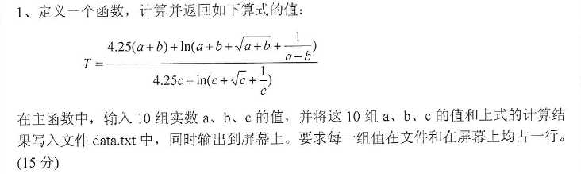
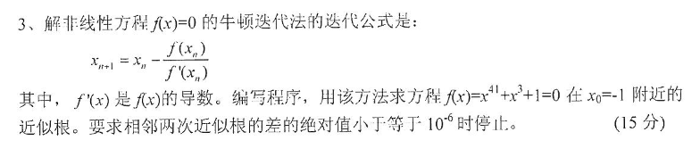

# 2018
## 一

|1|2|3|4|5|6|7|8|9|10
|-|-|-|-|-|-|-|-|-|-|
|B|B|B|D|C|D|B|A|C|D|

## 二
```
1. 0，1，3，3
2. 1.5*exp(x)+2*sin(x)+3*log(x)/log(a)
3. float
4. ch>='0' && ch<='9'
5. 10
6. good，d
```
## 三
```
1. 20
2. 10
3. 1,mincomputer
4. 1357
5. 302010
```
## 四
```
1. 
(1) const
(2) i < j
(3) a[i] = a[j-1]
(4) a[j-1] = t
(5) --
2.
(6) sieve[i] = 1
(7) sieve[factor] == 1
(8) sieve[k] = -1 
(9) k + factor 
(10) factor++ 
3.
(11) p == q
(12) max = s
(13) p,max
(14) p+1,q
(15) array,&array[N-1]
```
## 五
1. 


#### 分析


方法一：
```c
#include <stdio.h>
#include <math.h>
#include <stdlib.h>
#define f(n) 4.52*(n)+log((n)+sqrt(n)+1/(n))

double T(double a, double b, double c) {
    return f(a + b) / f(c);
}

int main() {
    FILE *fp;
    double m[10][3];
    double res;
    if ((fp = fopen("data.txt", "w")) == NULL) {
        printf("error");
        exit(0);
    }
    printf("输入10组:a,b,c\n");
    for (int i = 0; i < 10; i++) {
        scanf("%lf,%lf,%lf", &m[i][0], &m[i][1], &m[i][2]); //注意输入时用英文逗号间隔
    }

    for (int i = 0; i < 10; i++) {
        res = T(m[i][0], m[i][1], m[i][2]);
        fprintf(fp, "%f\t%f\t%f\t%f\n", m[i][0], m[i][1], m[i][2], res);
        printf("%f\t%f\t%f\t%f\n", m[i][0], m[i][1], m[i][2], res);
    }
    fclose(fp);
    return 0;
}
```
方法二：

```c
#include <stdio.h>
#include <math.h>
#include <stdlib.h>

double T(double a, double b, double c) {
    return (4.25*(a+b))+log(a+b+sqrt(a+b)+1/(a+b))/(4.25 * c + log(c + sqrt(c) + 1 / c));
}

int main() {
    FILE *fp;
    double m[10][3];
    double res;
    if ((fp = fopen("data.txt", "w")) == NULL) {
        printf("error");
        exit(0);
    }
    printf("输入10组:a,b,c\n");
    for (int i = 0; i < 10; i++) {
        scanf("%lf,%lf,%lf", &m[i][0], &m[i][1], &m[i][2]);
    }

    for (int i = 0; i < 10; i++) {
        res = T(m[i][0], m[i][1], m[i][2]);
        fprintf(fp, "%f\t%f\t%f\t%f\n", m[i][0], m[i][1], m[i][2], res);
        printf("%f\t%f\t%f\t%f\n", m[i][0], m[i][1], m[i][2], res);
    }
    fclose(fp);
    return 0;
}
```

2.


#### 分析
题目要求是前一位要大于等于后一位，那么用除法和模运算将每一位分离，也就是数字后一位要小于等于前一位

```c
#include <stdio.h>

int isDown(int n) {
    int back, front;
    while (n / 10) {//(n/10)不为0，进入循环。也就是n是大于两位数时。
        //或是直接写while(n>10)
        back = n % 10;//后一个数
        n = n / 10;
        front = n % 10;//前一个数
        if (back > front)//只要有后一位数大于前一位数，就终止判断。
            return 0;
    }
    return 1;   //降序数或n为1位数时返回1
}

int main() {
    int n;
    printf("Input a number\n");
    scanf("%d", &n);
    if (isDown(n))
        printf("是降序数");
    else printf("不是降序数");
    return 0;
}
```

3. 


#### 分析
- 题中出现相邻两次进似根，则出现两个变量
- 10^-6^表示为1E-6
- 这不是数学题，不需要分析，方法是穷举，所以说直接将方程代到公式中
```c
#include <stdio.h>
#include <math.h>

int main() {
    double a, x = -1;   //设两次的根，首次为-1，第二次待求
    while (fabs(a - x) > 1E-6) {//当两次近似根差的绝对值小于等于1E-6停止
        a = x;  //将第一次根暂存
        x = x - (pow(x, 41) + x * x * x + 1) / (41 * pow(x, 40) + 3 * x * x);//求下次根
    }
    printf("%f", x);
    return 0;
}
```