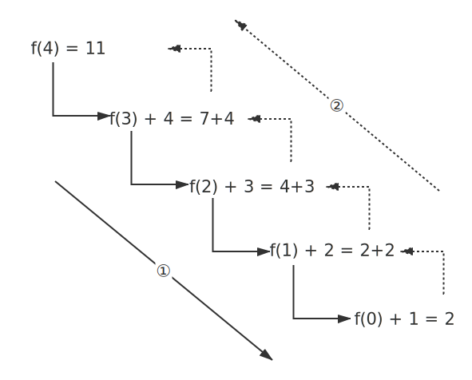

# 2019
## 一

9. **对于以下递归函数f，调用f(4)其返回值为( )。**
```c
int f(int n)
{
    if(n <= 0) return 1;
    return f(n-1)+(n++);
}
```
<pre>A) 10      B) 11       c) 15       D)以上均不是</pre>
**分析：**
递归每次f(n)中的n指代的都不一样,下面给每个n标识一个序号：
第一次：f($n_4$)=f($n_3$)+($n_4$++)，其中$n_3$ = $n_4$-1，$n_3$先计算出来，$n_4$再自增
第二次：f($n_3$)=f($n_2$)+($n_3$++)，其中$n_2$ = $n_3$-1，$n_2$先计算出来，$n_3$再自增
第三次：f($n_2$)=f($n_1$)+($n_2$++)，其中$n_1$ = $n_2$-1，$n_1$先计算出来，$n_2$再自增
第四次：f($n_1$)=f($n_0$)+($n_1$++)，其中$n_0$ = $n_1$-1，$n_0$先计算出来，$n_1$再自增

由此可见，（n++）并不影响f(n)。



**拓展：**
```c
int f(int n)
{
    int tmp;
    if(n <= 0) return 1;
    tmp = n++;
    return f(n-1)+tmp;
}
```
此时运行过程：
```c
int f(int 4)            //n 为 4
{                   
    int tmp;
    if(n <= 0) return 1;
    tmp = n++;          //tmp 为 4
                        //n 为 5
    return f(n-1)+tmp;  //返回f(4)+4
}
```
以上例子陷入无限循环。


## 三

2. **程序运行结果**
```c
#include <stdio.h>

int f(int m, int n) {
    int a, b;
    a = n++;
    b = --m;
    return (a + b);
}

int main() {
    int a, b, c;
    a = 5;
    b = 6;
    printf("%d,%d,", a, b);
    c = f(a, b);
    printf("%d,%d,%d\n", a, b, c);
    return 0;
}
```
5,6,5,6,10


3. **程序运行结果**
```c
#include <stdio.h>

int main() {
    static int a[] = {1, 2, 3, 4, 5};
    int x, y, *p;
    p = &a[0];          //将指针p指向数组a，也就是p=a
    x = *(p + 3);       //相当于p[3],也就是a[3]
    y = ++p[4];         //相当于++(a[4])
    printf("%d%d%d%d\n", *a, *p, x, y);     //相当于输出a[0],p[0],a[3],++(a[4])
    return 0;
}
```
1146


## 五

2. 

```C
#include <stdio.h>

#define N 52

int main() {
    int a[N] = {0}, i, j, up = 0;
    for (i = 2; i <= N; i++)       //从第2张牌开始
        for (j = i; j <= N; j++)   //2的倍数
            if (j % i == 0)
                a[j - 1] = !a[j - 1]; //a[j-1]就是a[1]也就是第2张牌
    for (i = 0; i < N; i++) {
        if (a[i] == 0)
            up += 1;
    }
    printf("有%d张牌正面朝上", up);
    return 0;
}
```